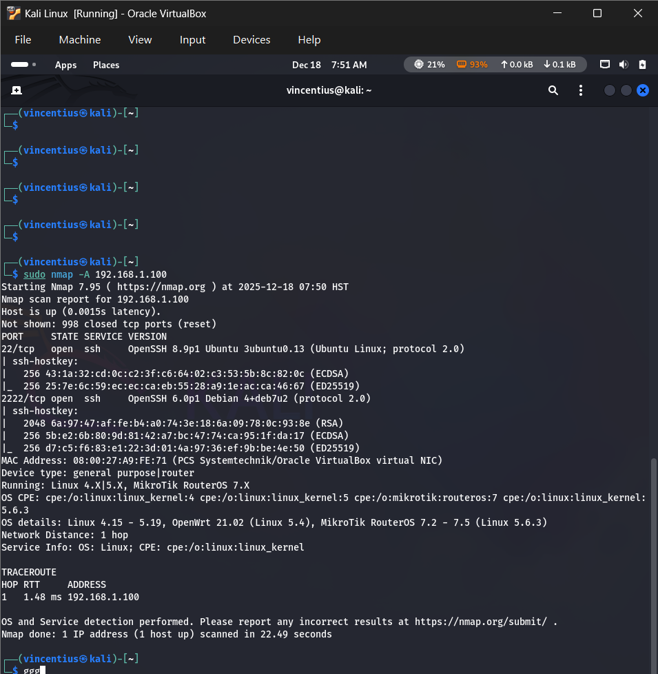
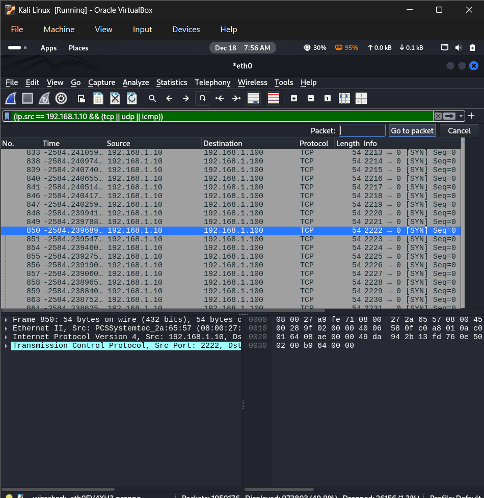

# Nmap-attack-recording-using-wazuh

## 1. PING EACH MACHINE TO OTHER MACHINE

### A.Kali Linux (Attacker)

### B.Honeypot Ubuntu

### C.Wazuh Manager

## 2. Nmap ATTACK TEST
nmap -a 192.168.1.100

## 3. WAZUH DASHBOARD LOGS

## 4. WAZUH DASHBOARD DISPLAY

## 5. WIRESHARK DISPLAY
Using (ip.src == 192.168.1.10) && (tcp || udp || icmp)

